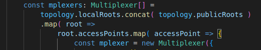
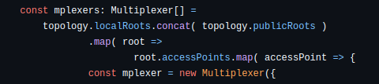
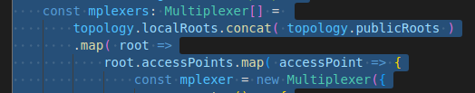

## why 4 spaces and not tabs?

take this code

seems all good, right? Except, this is how github will render it:

do you see the strange indentation? The `.map` and `root.accessPoints` lines are shifted!

in vs code if you try to select the faulty code you'll immediately see why:

 
as you can see, the faulty lines have a `→` where the correctly indented ones have `····`.

Here is how it should look instead:

When highlighted, vs code marks spaces as `·` and tabs as `→`, so that you can immediately see what is going on here.

Using spaces allows for consistent renders pretty much everywhere.
